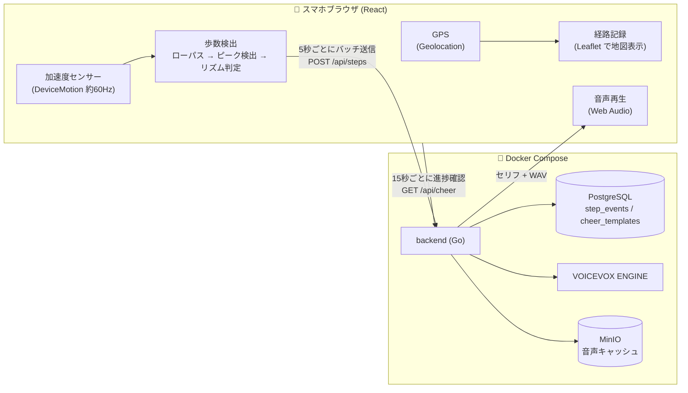
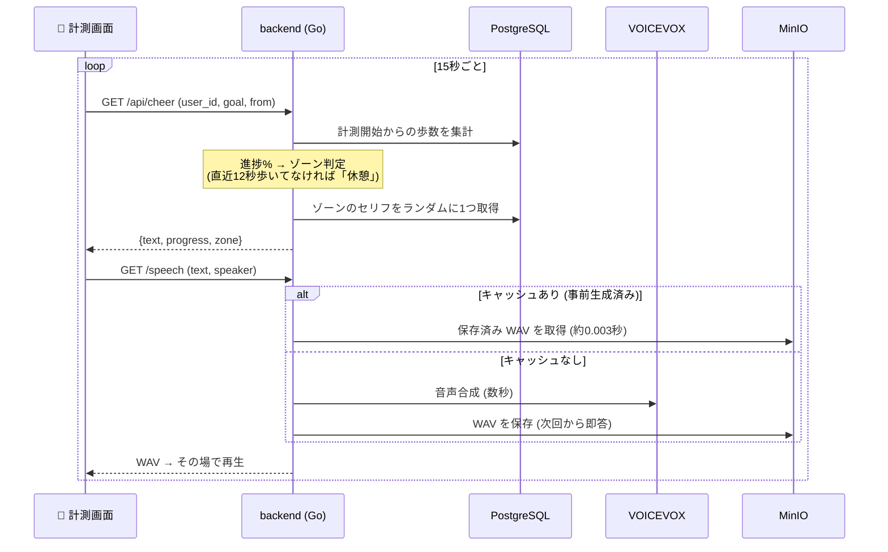

# more - 応援してくれる運動アプリ

## 作品概要

**作品名：** more
**理由：** 「もっと(more)歩きたくなる」体験を届けたい、という思いから。

**制作目的と理由（背景を含む）**

- 運動は始めるより続けるほうが難しい。「応援してくれる存在」がいれば続けられるのではとおもったから
- アプリのインストール不要・スマホのブラウザだけで、ポケットに入れて歩くだけで使えるものにしたかった
- 歩数・距離・時間・消費カロリーなど、その人なりの目標の立て方に寄り添いたい

**技術スタック：**

- **フロントエンド：** React + TypeScript + Vite / Web API (DeviceMotion, Web Audio, Geolocation, Wake Lock)
- **バックエンド：** Go (net/http) + sqlc + pgx/v5
- **DB：** PostgreSQL 16
- **音声合成：** VOICEVOX ENGINE
- **ストレージ：** MinIO (S3互換・音声キャッシュ)
- **地図：** Leaflet + OpenStreetMap
- **開発・実行環境：** Docker Compose / Cloudflare Tunnel / Git・GitHub

**ターゲット：** 運動を始めたい・続けたいすべての人（ウォーキング〜ランニング）

---

## このドキュメントについて

このドキュメントは、ハッカソンで開発した作品「more」のREADMEです。

## チーム構成

| メンバー | 担当 |
|---|---|
| @lemonade-2061 | 歩数検出・バックエンド・インフラ |
| @KAN1015 | フロントエンド・UIデザイン |
| @chihiro12-t | バックエンド（音声） |
| @ShinShin1126 | フロントエンド・UIデザイン |

## 機能一覧

### 実装済みの機能

#### 計測

- [x] スマホの加速度センサーによる歩数検出（ブラウザのみ・インストール不要）
- [x] 歩幅換算による距離表示（1000m 以上は km 表記）
- [x] GPS による歩行経路の記録・リザルトでの地図表示
- [x] 計測中の画面スリープ抑止（Wake Lock）
- [x] iOS Safari 対応（センサー・位置情報の許可フロー、音声の自動再生対策）

#### 応援ボイス

- [x] 進捗に応じた応援セリフの自動再生（5ゾーン × 各10種、15秒ごと）
- [x] 停滞検知（12秒歩いていないと「休憩ゾーン」のセリフに切り替え）
- [x] マイルストーン音声（残り100m / 50m / 10m で「あと◯メートル」）
- [x] 目標達成の祝福ボイス
- [x] 応援キャラ選択（ずんだもん / 四国めたん / 春日部つむぎ）
- [x] 音声キャッシュ（一度合成したセリフは約0.003秒で即答）

#### 目標設定・画面

- [x] 4種類の目標設定（歩数 / 距離km / 時間分 / 消費カロリーkcal）
- [x] カロリー目標用の体重入力（localStorage に保存）
- [x] タイトル → セットアップ → 目標設定 → カウントダウン → 計測 → リザルトの画面フロー
- [x] リザルトでの前回比表示（+◯m）
- [x] 背景アニメーション

#### 開発支援

- [x] 歩数検出の調整画面（`?debug=1`：リアルタイム波形・閾値スライダー・生ログCSV）
- [x] ボイステスト画面（`?debug=voice`：セリフ自由入力・スピーカー切替・応答時間計測）

### 主要機能の詳細

#### 1. 歩数検出

```
|加速度| → ローパスフィルタで重力除去 → 閾値(1.5m/s²)の上向きクロスでピーク検出
        → 不応期600ms (着地後の揺り戻しによる二重カウントを防止)
        → リズム判定: 1.5秒以内の間隔で3回続いたら「歩行中」と確定
          (ポケット出し入れや手ブレなど単発の衝撃は歩数にしない)
```

パラメータはすべて実機で歩いて取った波形データ（`?debug=1` の調整画面で採取した CSV）を分析して決定。
「20歩歩いて33歩カウントされる」状態から、検出間隔の分布を調べて二重カウントの原因（着地後400〜580msの揺り戻しピーク）を特定し、±数歩まで追い込んだ。

#### 2. 応援ボイスシステム

| ゾーン | 進捗 | 例 |
|---|---|---|
| start | 0〜30% | 「さあスタート！まずはリラックスしていこう！」 |
| middle | 30〜70% | 「順調順調！すごく良いペースで走れているよ！」 |
| push | 70〜90% | 「ここからが本番！」 |
| last | 90〜100% | 「ラストスパート！」 |
| pause | 停滞中 | 「水分補給したら、もう一度チャレンジしてみよう！」 |

- 一度合成した音声は MinIO にキャッシュされ、2回目以降は**約0.003秒**で応答（初回合成は数秒）
- 全セリフ × 3キャラを事前生成済みのため、本番では常に即レス

#### 3. 目標設定

すべての目標は内部的に「歩数」へ換算して扱う。

- 距離: `歩数 = 距離 ÷ 歩幅0.7m`
- 時間: `歩数 = 分 × 100歩/分`
- カロリー: `消費カロリー ≒ 体重(kg) × 距離(km) × 1.05` の近似式から逆算（体重は入力可能）

#### 4. 経路マップ

- 計測中に Geolocation で座標を記録（精度50m超・移動3m未満の点は除外してジッタを抑制）
- リザルト画面で OpenStreetMap 上に歩いたルートを描画
- GPS が取れない環境（屋内など）では理由を表示して非表示

## アーキテクチャ

### 全体構成



- スマホ側は**ブラウザだけ**で完結（アプリのインストール不要）。センサー処理・歩数判定はすべてフロントで行い、確定した「歩イベント」だけをサーバーに送る
- サーバー側は歩数の記録と集計、進捗に応じたセリフ選択、音声合成+キャッシュを担当

### 応援ボイスが鳴るまでの流れ



### API 一覧

| メソッド | パス | 役割 |
|---|---|---|
| POST | `/api/steps` | 歩イベントのバッチ登録 |
| GET | `/api/steps/summary` | 期間内の合計・分単位の推移 |
| GET | `/api/cheer` | 進捗に応じた応援セリフの取得 |
| GET | `/speech` | 音声合成（キャッシュ付き） |
| DELETE | `/api/steps` | 歩数記録の削除（テスト用） |

## こだわりポイント

- **歩数検出は実測データ駆動でチューニング** — 勘ではなく、生波形の CSV を分析して閾値・不応期を決定。3DS の歩数計と同じ「リズム判定」方式で誤検出を排除
- **音声の即レス** — キャッシュ導入で合成6秒 → 0.003秒。応援が「今」届く
- **スマホブラウザの制約** — iOS の許可ダイアログはユーザー操作の文脈でしか出せない、マナーモードで Web Audio が消音される、画面ロックでセンサーが止まる、などの罠を一つずつ回避
- **停滞検知** — ただ歩数を数えるだけでなく、「立ち止まったら休憩の声かけに変わる」ことで、応援に体温を持たせた

## 開発セットアップ

### 前提条件

Docker (Compose) が動く環境。ホストに Go / Node のインストールは不要。

### 起動方法

```bash
# 環境変数の準備（書き換え不要でそのまま動く）
cp .env.example .env

# 全サービス起動（初回はビルドが走る）
docker compose up -d --build

# 応援セリフの投入
docker compose exec -T db psql -U app -d app < backend/db/seed.sql
```

http://localhost:5173 で開けます。

### スマホ実機で試す場合

加速度センサー・GPS は HTTPS が必須のため、トンネルを張ります：

```bash
cloudflared tunnel --url http://localhost:5173
```

表示された `https://〜.trycloudflare.com` をスマホで開く（URL は起動ごとに変わるので注意）。

### デバッグ画面

| URL | 内容 |
|---|---|
| `/?debug=1` | 歩数検出の調整画面（波形・閾値スライダー・生ログCSV） |
| `/?debug=voice` | ボイステスト画面（セリフ入力・キャラ切替・応答時間計測） |

### 開発ルール

sqlc の使い方・依存パッケージの追加手順などの開発ルールは [CLAUDE.md](CLAUDE.md) を参照。
特に**依存を追加したら `docker compose up -d --build` でイメージを焼き直して go.mod / package.json をコミットする**こと。

## プロジェクト構成

```text
hackathon/
├── README.md
├── CLAUDE.md                        # 開発ルール
├── docker-compose.yml               # 全サービス定義 (db/minio/voicevox/backend/frontend)
├── .env.example                     # 環境変数のテンプレート
├── backend/
│   ├── cmd/
│   │   ├── server/main.go           # エントリポイント (DB接続・ルーティング)
│   │   └── seed_voice/              # 音声事前生成ツール
│   ├── internal/
│   │   ├── handler/                 # HTTPハンドラ (steps / cheer / voicevox)
│   │   ├── db/                      # sqlc 生成コード (手で編集しない)
│   │   ├── store/                   # S3互換ストレージ (音声キャッシュ)
│   │   └── voicevox/                # VOICEVOX ENGINE クライアント
│   └── db/
│       ├── schema/                  # テーブル定義 (sqlc の入力)
│       ├── queries/                 # クエリ定義 (sqlc の入力)
│       └── seed.sql                 # 応援セリフ50種の初期データ
└── frontend/src/
    ├── App.tsx                      # 画面遷移と計測ロジックの配線
    ├── pages/                       # 各画面 (Home/Setup/Setting/Count/Result + デバッグ2種)
    ├── steps/                       # 歩数検出・GPS経路・ユーザーID
    ├── audio/player.ts              # 音声再生 (スマホの自動再生ブロック対策込み)
    ├── map/RouteMap.tsx             # 経路地図 (Leaflet)
    ├── api/                         # backend への fetch
    └── utils/                       # 距離フォーマットなど
```

## 困ったときは

| 症状 | 原因と解決 |
|---|---|
| スマホでセンサーが動かない | HTTPS 必須。トンネル経由で開く |
| iOS で許可ダイアログが出ない | 許可要求はボタンタップの文脈でしか出せない。過去に拒否した場合は Safari の Webサイト設定を確認 |
| iOS で音が鳴らない | 本体横の消音スイッチ（マナーモード）を OFF に |
| 地図が出ない | 屋内では GPS が取れない（精度の悪い点は捨てる仕様）。屋外で歩くと出る |
| コンテナから外部に繋がらない | Wi-Fi 切替後に DNS が死ぬことがある → `docker compose down && docker compose up -d` |
| トンネル URL に繋がらない | URL は張り直すたびに変わる。QR コードで再共有する |
| `down -v` してしまった | DB・音声キャッシュが全消去される。**`-v` は絶対に付けない**。消えたら seed 再投入+キャッシュ温め直し |

## クレジット

音声合成に [VOICEVOX](https://voicevox.hiroshiba.jp/) を使用しています。

- VOICEVOX:ずんだもん
- VOICEVOX:四国めたん
- VOICEVOX:春日部つむぎ

地図の表示に [Leaflet](https://leafletjs.com/) と [OpenStreetMap](https://www.openstreetmap.org/)（© OpenStreetMap contributors）を使用しています。
