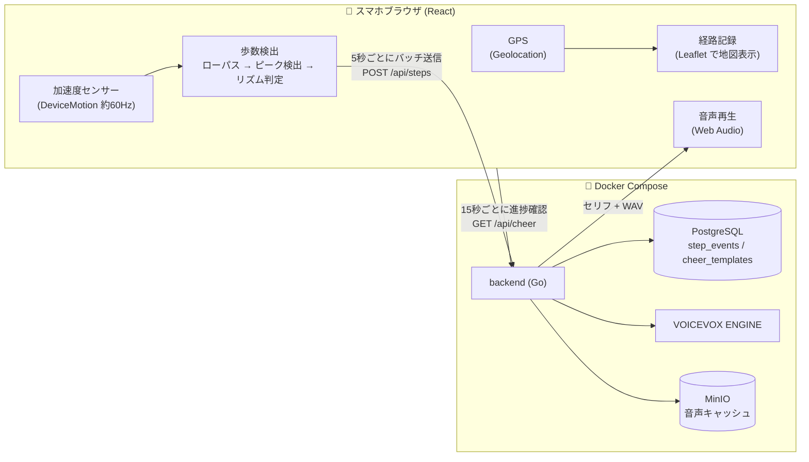
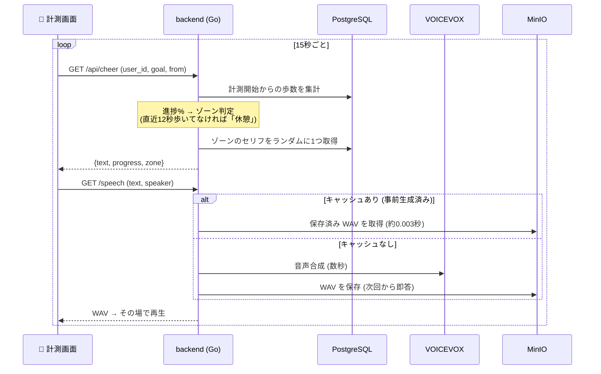

# **more**

## 概要

ランニングやウォーキングのときに応援してくれるWebアプリ

## 主な機能

- 歩数検出
- 進捗に応じたボイス
- 目標設定(距離、歩数、時間)

## 使用技術

- フロント    : React + Vite + TypeScript / WebAPI (Device Motion, Web Audio, Wake Lock, sendBeacon)
- バック　    : Go(net/http) + sqlc + pgx/v5
- DB          : PostgreSQL 16
- 音声        : VOICEVOX ENGINE
- ストレージ  : MinIO (S3互換)
- 地図        : Leaflet + OpenStreetMap
- インフラ    : Docker Compose / Cloudflare Tunnel

## アーキテクチャ

### 全体構成



- スマホ側は**ブラウザだけ**で完結 (アプリのインストール不要)。センサー処理・歩数判定はすべてフロントで行い、確定した「歩イベント」だけをサーバーに送る
- サーバー側は歩数の記録と集計、進捗に応じたセリフ選択、音声合成+キャッシュを担当

### 応援ボイスが鳴るまでの流れ



### 歩数検出の仕組み

```
|加速度| → ローパスフィルタで重力除去 → 閾値(1.5m/s²)の上向きクロスでピーク検出
        → 不応期600ms (着地後の揺り戻しによる二重カウントを防止)
        → リズム判定: 1.5秒以内の間隔で3回続いたら「歩行中」と確定
          (ポケット出し入れや手ブレなど単発の衝撃は歩数にしない)
```

パラメータはすべて実機で歩いて取った波形データ (`?debug=1` の調整画面で採取) を分析して決定。

### API 一覧

| メソッド | パス | 役割 |
|---|---|---|
| POST | `/api/steps` | 歩イベントのバッチ登録 |
| GET | `/api/steps/summary` | 期間内の合計・分単位の推移 |
| GET | `/api/cheer` | 進捗に応じた応援セリフの取得 |
| GET | `/speech` | 音声合成 (キャッシュ付き) |
| DELETE | `/api/steps` | 歩数記録の削除 (テスト用) |

## ポイント

- 歩数検出は実測データでチューニング(揺り戻しの二重カウントを間隔分析で発見 → 不応期600ms。3DSと同じリズム判定方式)
- 停滞検知 (12秒歩いてないとカウントされないと休憩のセリフ)
- スマホの制約対応 (iOSの許可フロー、自動再生ブロック、画面スリープ)

## 起動方法

- `cp .env.example .env` → `docker compose up -d --build` → localhost:5173
- スマホは HTTPS 必須: `cloudflared tunnel --url http://localhost:5173`
- seed: `docker compose exec -T db psql -U app -d app < backend/db/seed.sql`

## クレジット

音声合成に [VOICEVOX](https://voicevox.hiroshiba.jp/) を使用しています。

- VOICEVOX:ずんだもん
- VOICEVOX:四国めたん
- VOICEVOX:春日部つむぎ

